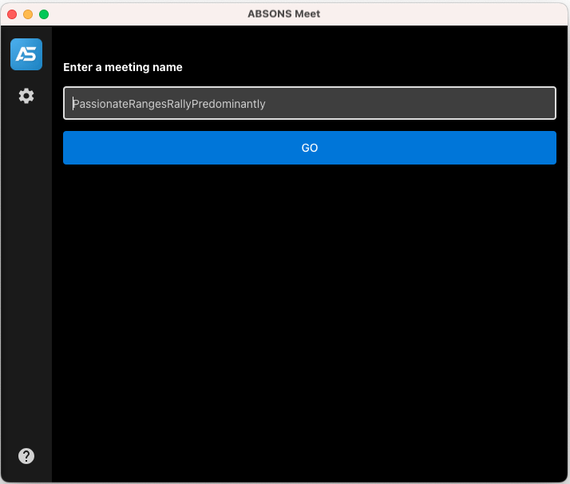

# ABSONS Meet Electron

Desktop application for **ABSONS Meet** built with Electron.



## Releases

Download the latest desktop builds from GitHub Releases:

https://github.com/absonsnet/absons-meet-electron/releases/latest

## Features

- End-to-end encrypted meeting experience (server dependent)
- Built-in auto updates
- Screen sharing support
- Always-on-top meeting window
- Deep linking via `absons-meet://`
- Works with configurable ABSONS Meet deployment URLs

## Development

### Requirements

- Node.js 22+

### Install dependencies

```bash
npm install
```

### Generate branding icons

```bash
npm run generate-icons
```

### Start development mode

```bash
npm start
```

### Build production bundles

```bash
npm run build
```

### Build installers/packages

```bash
npm run dist
```

## Notes

- The app keeps internal Jitsi SDK dependencies such as `@jitsi/electron-sdk` and `JitsiMeetExternalAPI` for runtime compatibility.
- Desktop protocol scheme is `absons-meet://`.

## License

Apache License 2.0. See [LICENSE](LICENSE).
